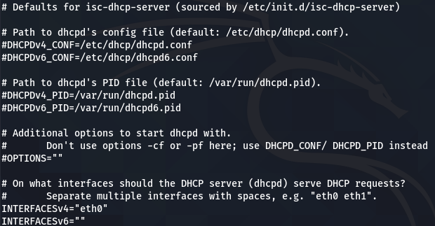
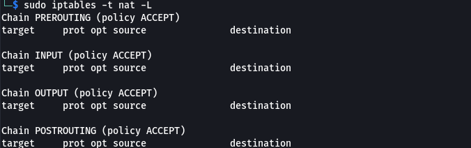

<h1 align="center">NET Helper</h1>

## 📋 &nbsp;Setup DHCP Server

**DHCP** (Dynamic Host Configuration Protocol) - automatically provides IP addresses and other network settings (subnet mask, gateway, etc.) to computers and various devices on the network.

The client sends a broadcast packet `DHCPDISCOVER` in search of a server. In turn, the DHCP server considers the request and sends a `DHCPOFFER` with possible IP addresses. The client selects the address and sends `DHCPREQUEST` with the selected address. The server then sends a confirmation (`DHCPACK`).

<h4 align="center"><b>Initial Conditions</b></h4>

**PC** (Kali, Ubuntu, etc.):
- _eth0_, IP: `192.168.1.9/24`

<h4 align="center"><b>Settings</b></h4>

1) Install the DHCP server with command:

```sh
$ sudo apt-get install isc-dhcp-server
```

2) In the file `/etc/default/isc-dhcp-server` you need to specify your interface:

<p align="center">
  
</p>

3) Configure the config file. Open the config file `/etc/dhcp/dhcpd.conf`. By default, the file contains config examples. You can delete the example and insert the following config:

```sh
default-lease-time 600;
max-lease-time 7200;

option subnet-mask 255.255.255.0;
option broadcast-address 192.168.1.255;
option routers 192.168.1.1;
option domain-name-servers 192.168.1.1, 8.8.8.8;
option domain-name "mydomain.example";

subnet 192.168.1.0 netmask 255.255.255.0 {
range 192.168.1.50 192.168.1.100;
}
```

- `default-lease-time` - the time for which the IP address is issued;
- `max-lease-time` - the maximum time for which the IP address is issued;
- `option subnet-mask` - the subnet mask to which the IP address is issued;
- `option routers` - the address of the router, also a possible option when one of the computers gives the IP address to another computer, then one computer is a router for another;
- `subnet 192.168.1.0` - our subnet;
- `range 192.168.1.50 192.168.1.100` - range of IP-addresses that will be issued.

4) Check ufw status, it should be **inactive**:

```sh
$ sudo ufw status
```

Otherwise:

```sh
$ ufw allow 67/udp
$ ufw reload
$ ufw show
```

5) Start DHCP:

```sh
$ sudo dhcpd
```

If you see the following message: `Can't open /var/lib/dhcp/dhcpd.leases for append`

Then modify the rights to this file using the following command:

```sh
$ sudo chmod 777 /var/lib/dhcp/dhcpd.leases
```

And run DHCP again:

```sh
$ sudo dhcpd
```

Now the DHCP server has to listen for requests on our interface. 

There must be lines `Listening on ...`, `Sending on ...`.

Alternatively, to start the DHCP service, you can use the command:

```sh
$ sudo systemctl start isc-dhcp-server.service
```

6) Now let's check if our server has started:

```sh
$ sudo systemctl status isc-dhcp-server.service
```

If the server is inactive, restart it with the command and check status again:

```sh
$ sudo systemctl restart isc-dhcp-server.service
$ sudo systemctl status isc-dhcp-server.service
```

If you want a service to start on every reboot then you need:

```sh
$ sudo systemctl enable isc-dhcp-server.service
```

7) To release the current address and get a new one, execute the following commands:

```sh
$ sudo dhclient -r eth0
$ sudo dhclient -v eth0
```


8) Enter the following command to make sure you get a new address:

```sh
$ ifconfig
```

or 

```sh
$ ip a
```


Now everything is ready! 

In Wireshark, you can view in detail the interaction of the DHCP server with the client. 
Also, a new entry will appear in the `var/lib/dhcp/dhcpd.leases` file.


## 📋 &nbsp;Setup NAT

**NAT** (Network Address Translation) is a procedure for replacing IP addresses and ports in the packet header. NAT is used to replace the IP address of the internal network with an external IP address (such as a router). If other computers on the Internet try to access the computer on the local network, they only see the address of the router.

The main goal of NAT is to overcome the lack of IPv4 addresses. That is, many local addresses are displayed by a single external IP address of the router. It can be used to connect large networks to the Internet using only one external IP address.

<h4 align="center"><b>Initial Conditions</b></h4>

**PC1** - Kali:
- _eth0_, IP: `10.0.2.15/24`
- _eth1_, IP: `192.168.1.1/24`

**PC2** - Ubuntu:
- _enp0s3_, IP: `192.168.1.2/24`; Gateway: `192.168.1.1`


- DHCP server on PC1, _eth1_;
- PC1 has access to the Internet via _eth0_;
- PC1 and PC2 in the local network (PC1: _eth1_, PC2: _enp0s3_).

<h4 align="center"><b>Settings</b></h4>

1) Check the local connection between PC1 and PC2 using the commands for the first computer `ping <IP PC2>` and for the second computer `ping <IP PC1>`.

2) Make sure PC1 has access to the Internet and PC2 doesn't by `ping google.com`.

3) Let's check the table of a static configuration by a command:

```sh
$ netstat -rn
```

For a PC1 (server), the gateway must be the router itself. And for the PC2 (client), the gateway is PC1.


4) Now let's look at the current NAT rules:

```sh
$ sudo iptables -t nat -L
```

This command shows the current NAT rules in iptables. If you have just set up your server, you will have no rules and the command should show the following:

<p align="center">
  
</p>

5) If you have the same result as above, the rules are not configured and you can move on. If not, clear the table as follows:

```sh
$ sudo iptables -t nat -F
```

6) For NAT, you must enable routing in the Linux kernel:

```sh
sudo sysctl -w net.ipv4.ip_forward=1
```

Or:

```sh
sudo bash -c "echo 1 > /proc/sys/net/ipv4/ip_forward"
```

To prevent this parameter from resetting after restarting the system, we need to add the following line to the `/etc/sysctl.conf` file:

```sh
net.ipv4.conf.all.forwarding=1
```

7) Add a rule for NAT using one of the following commands:

```sh
sudo iptables -t nat -A POSTROUTING -s 192.168.1.0/24 -j MASQUERADE
sudo iptables -t nat -A POSTROUTING -o eth0 -j MASQUERADE
sudo iptables -t nat -A POSTROUTING -o eth0 -s 192.168.1.0/24 -j MASQUERADE
```

where `192.168.1.0` is an internal network, and `eth0` is the interface through which you access the Internet.

There is no need to save for these commands, because these commands work immediately. But after restarting the system, you will need to enter this command again.

However, we can save the iptables settings to a file so that NAT works after the system restarts. To do this, save the iptables settings to a file:

```sh
sudo iptables-save > /etc/iptables.rules
```

If this command fails, switch to superuser mode using the `sudo su` command.

To automatically upload the rules, add the following line to the `/etc/networks/interfaces` file:

```sh
post-up iptables-restore < /etc/iptables.rules
```

8) Let's check the added rule with the command:

```sh
$ sudo iptables -t nat -L
```


9) Make sure the DHCP server (on PC1) is configured correctly and is now active. The settings for DHCP were described above in paragraphs 1-6, leave the `/etc/dhcp/dhcpd.conf` file as in the example above, but set the interface `eth1` (not `eth0` as in example above) in the `/etc/default/isc-dhcp-server` file.


```sh
$ sudo systemctl status isc-dhcp-server.service
```

If inactive:

```sh
$ sudo systemctl restart isc-dhcp-server.service
```

Get a dynamic address on PC2 with the command:

```sh
$ sudo dhclient -v enp0s3
```

Look at the newly received address on PC2 with the command `ip a` or `ifconfig`.


10) Now check the availability of the Internet on PC2 (you can also run Weirshark on PC1 and view the whole process):

```sh
$ ping 8.8.8.8
$ ping google.com
```

The Internet is there, everything is ready!


## 📫 &nbsp;Get in touch

<p align="center">
<a href="https://www.linkedin.com/in/yevhenii-shendrikov-6795291b8/"></a>
<a href="mailto:jackshendrikov@gmail.com"></a>
<a href="https://www.facebook.com/jack.shendrikov"></a>
<a href=""></a>
</p>
